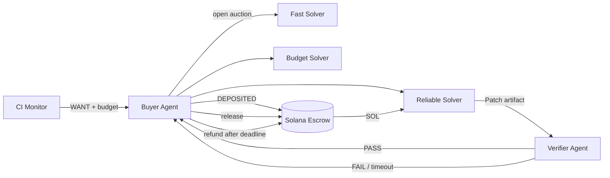

# PatchBond

### Autonomous code repair with payment for verified outcomes

> **No fix, no pay.** A buyer agent posts a failing software task, solver agents compete on price and capability, an independent verifier runs the tests, and Solana devnet escrow releases payment only after a passing verdict.

PatchBond is an entry for the Imperial AI Agent Hackathon — Solana × CoralOS track. It turns software maintenance into an agent economy with objective delivery evidence instead of trusting an LLM's claim that a task is complete.

## Short version

**What it is:** a marketplace where autonomous solver agents compete to repair failing code. The buyer locks devnet SOL in escrow; the winner is paid only after an independent verifier runs the pinned tests successfully.

**User journey:**

```text
Connect GitHub repo → pin commit/failure → set budget → collect bids
→ award best-value solver → verify patch → open PR → release or refund
```

**Why it matters:** coding agents can claim that a patch works, but PatchBond purchases a measurable outcome—passing tests against an immutable base revision—with visible auction reasoning and Solana settlement proof.

**What works now:** repository validation and commit pinning, three-agent bidding, deterministic patch delivery, independent test execution, real devnet escrow instructions, release/refund paths, proof artifacts, and the platform dashboard. The current repair round uses a built-in deterministic fixture; automatic conversion of an arbitrary repository's failed CI/issue into a task and PR is the next adapter.

**Fastest review:**

```bash
npm install --no-audit --no-fund --ignore-scripts
npm run demo:patchbond       # terminal proof: auction + patch + 3/3 tests
npm run platform:patchbond   # dashboard: http://127.0.0.1:4173
```

For the full CoralOS + Solana devnet lifecycle, see [Live CoralOS + Solana devnet](#live-coralos--solana-devnet).

---

## Detailed version

### The 30-second demo

```text
WANT       failing discount calculation · budget 0.020 SOL
BID        fast-fix       0.018 SOL · 45s  · score 73.9
BID        budget-bot     0.005 SOL · 150s · score 59.6
BID        reliable-patch 0.011 SOL · 80s  · score 88.9
AWARD      reliable-patch — best verified value, not lowest price
DEPOSITED  buyer funds a reference-bound Solana escrow
DELIVERED  versioned patch artifact + SHA-256
VERIFIED   3/3 allowlisted tests pass in an isolated verifier
RELEASED   escrow pays the solver; Explorer proof is recorded
```

A no-show or failed verification follows `DEPOSITED → TIMEOUT/FAILED → REFUNDED` after the on-chain deadline.

## Why this is worth buying

AI coding agents can generate patches, but buyers still face a trust problem: payment happens before quality is known, while subjective LLM review is easy to game. PatchBond defines the purchased service narrowly—**a patch that passes a pinned test suite against a pinned base revision**—and binds the task, delivery, verdict, and settlement with hashes and an order reference.

## Architecture


## Agent economy

| Agent | Economic role | Strategy |
|---|---|---|
| Buyer | Publishes the task, enforces budget, funds escrow | Maximizes expected value, not lowest price |
| Fast Solver | Sells speed | High price, short ETA |
| Budget Solver | Sells low-cost capacity | Low price, weaker track record |
| Reliable Solver | Sells specialized reliability | Balanced price, high success rate |
| Verifier | Produces deterministic outcome evidence | Hash checks + allowlisted test execution |
| Solana escrow | Holds and settles funds | Release after pass; refund after deadline |

The buyer's score weights reputation (30%), specialization (25%), success rate (20%), deadline fit (15%), and price value (10%). Every bid and the award reason are visible in the CoralOS transcript.

## Quick start: local proof

Requirements: Node.js 20+.

```bash
npm install --no-audit --no-fund --ignore-scripts
npm run demo:patchbond
```

This command performs a real patch application and executes the fixture's tests. It writes inspectable artifacts to `.artifacts/patchbond/`:

- `task.json` — immutable purchase specification;
- `bids.json` — scored auction bids;
- `delivery.json` — versioned patch artifact;
- `proof.local.json` — verifier verdict and hashes;
- `test-output.tap` — raw test evidence.

**The local command never fabricates a blockchain signature.** It prints `ESCROW_PLANNED` and `RELEASE_READY`; only the CoralOS devnet run may print `DEPOSITED`, `RELEASED`, or `REFUNDED` with Explorer URLs.

## Repository platform

Start the local dashboard manually:

```bash
npm run platform:patchbond
# open http://127.0.0.1:4173
```

Paste `owner/repository` or an HTTPS GitHub URL. The backend calls only the fixed GitHub API origin, verifies repository metadata, and pins the default branch's 40-character commit SHA. Public repositories require no credentials. Private access may use a local fine-grained `GITHUB_TOKEN`; it is never returned to the browser or logged.

**Before the connector:** every round used only the bundled `discount-bug` fixture; no user repository was involved.

**Current hybrid MVP:** Connect Repository performs real GitHub validation and immutable commit pinning, while the visible repair auction still uses the bundled deterministic fixture. This keeps the payment/verification demo reproducible and must not be mistaken for arbitrary-repository repair.

**Target product:** select a failed GitHub Check or issue from the connected revision, turn it into a task-scoped artifact, let the winner publish a branch/PR, and settle against the resulting check verdict.

```text
CONNECT REPO → PIN COMMIT → SELECT FAILURE → SET BUDGET
→ AGENT AUCTION → PATCH → VERIFY → PR → RELEASE/REFUND
```

Automated issue/check selection and PR publication are the next GitHub App adapter. Agents will receive task-scoped artifacts rather than a reusable account token.

## Live CoralOS + Solana devnet

Requirements: Node.js 20+, Docker Desktop, CoralOS container, and a newly generated buyer wallet funded with devnet SOL.

**Why Docker is needed:** the dashboard and local proof do not need it. Docker is required only for the judged agentic run: it starts CoralOS, a policy signer, plus isolated buyer, three seller, and verifier processes. The raw buyer key is mounted only into the signer through a gitignored Docker secret; CoralOS and market-agent session options receive only the non-secret `SIGNER_URL`. Without Docker, the UI and local `3/3 tests` proof work, but there is no real CoralOS multi-agent session and therefore no complete judged lifecycle.

```bash
npm run setup
# Fund only the public Buyer address printed by setup at https://faucet.solana.com
npm run agents:build
docker compose up -d --build signer coral
npm run demo:patchbond:coral
```

Expected lifecycle:

```text
WANT → BID × 3 → AWARD → DEPOSITED → DELIVERED → VERIFIED → RELEASED
```

**Recorded policy-signer round:** CoralOS session `046f5131-50b8-45f8-b80e-23ce1700ed0f` collected all three bids, awarded `reliable-patch` at score `88.9`, completed with `3 passed, 0 failed`, then finalized both devnet transactions:

- [Deposit 0.011 SOL](https://explorer.solana.com/tx/42jciDxyNQXnjFrDW3XMjgaKWJ7Vb31acXP54reESD34YEFrxNTLsZphotns5Mar44TwP1rzCG3KFEoGiecAHcsP?cluster=devnet)
- [Release after PASS](https://explorer.solana.com/tx/2GDCdZk1GjBrg6gP1bKnDkLM9keU4iHkkF5UJYHJMQBhSiEp8jdUNbCASNXCsPG7stAzKxihaTse6avqBdSTou2D?cluster=devnet)
- Machine-readable evidence: [`proofs/devnet-policy-signer-round.json`](proofs/devnet-policy-signer-round.json)

The buyer rejects non-devnet RPC endpoints, applies per-round/session spending caps, binds the awarded price and seller wallet, and requires the independent verifier before escrow release.

### Signer security boundary

The buyer agent never receives `BUYER_KEYPAIR_B58` in a PatchBond CoralOS session. A localhost-only sidecar reads `.secrets/buyer-keypair` as a Docker secret and exposes only `health`, `deposit`, `release`, and `refund` operations. It refuses non-devnet RPCs, any seller outside the configured allowlist, deadlines outside 15–300 seconds, reused references, and more than `0.02 SOL` of cumulative deposits per signer lifetime. This bounds wallet exposure without claiming production-grade custody: any process able to reach the local signer can request policy-compliant actions, so production should additionally use authenticated workload identity or a managed policy signer.

## Settlement design

PatchBond calls the deployed SOL escrow program directly rather than trusting a metadata-only payment facade.

| Item | Value |
|---|---|
| Network | Solana devnet only |
| Escrow program | `R5NWNg9eRLWWQU81Xbzz5Du1k7jTDeeT92Ty6qCeXet` |
| PDA seeds | `escrow`, buyer public key, order reference |
| Deposit signer | Buyer |
| Release signer | Buyer, after verifier PASS |
| Refund signer | Buyer, after on-chain deadline |

The current contract protects buyer funds but does not make the off-chain verifier trustless: buyer-agent policy gates release on the verifier's hash-bound verdict. Production deployment would use the included arbiter pattern or a verifier committee to prevent a dishonest buyer from withholding release. This limitation is stated rather than hidden.

## Verification and threat model

Patch deliveries are untrusted. The verifier:

1. checks the delivered payload hash against the buyer's observed hash;
2. validates the versioned schema and immutable task hash;
3. rejects absolute paths, traversal, duplicate files, oversized files, and paths outside the allowlist;
4. writes only the allowed artifact into an isolated temporary workspace;
5. runs a fixed test command with a timeout and minimal environment;
6. records pass/fail counts, duration, task hash, and delivery hash.

The hackathon fixture is intentionally narrow and deterministic. Arbitrary public repositories require stronger container limits, disabled networking, frozen dependencies, syscall controls, and no wallet/secret mounts.

## Repository map

```text
packages/patchbond-core/              task, scoring, artifacts, devnet escrow client
examples/patchbond/src/demo.ts        deterministic local proof
examples/patchbond/src/coral/round.ts five-agent CoralOS round launcher
examples/patchbond/fixtures/          pinned failing project and tests
coral-agents/buyer-agent/             auction, policy, deposit, verify, release/refund
coral-agents/seller-agent/            three configurable personas and patch delivery
coral-agents/verifier-agent/          independent hash + test gate
examples/txodds/                      retained upstream reference implementation
```

## Implementation status

- [x] Deterministic multi-seller best-value auction
- [x] Versioned task, delivery, and proof artifacts
- [x] Real patch application and test execution
- [x] CoralOS buyer/seller/verifier wiring
- [x] Direct Solana escrow deposit/release/refund instructions
- [x] Devnet-only and spending policy guards
- [x] No-show/refund branch
- [x] GitHub repository connector with immutable base-commit pinning
- [x] Responsive repository-to-auction platform dashboard
- [x] Record a funded live round and add its Explorer deposit/release links
- [ ] Add the final dashboard capture and 3-minute demo video

## Credits

Built on the MIT-licensed [Solana CoralOS Agent Commerce starter kit](https://github.com/trilltino/solana_coralOS). PatchBond's service, scoring, verifier, escrow lifecycle, agent graph, fixture, and submission documentation are new work.

## License

MIT — see [`LICENSE`](LICENSE).
